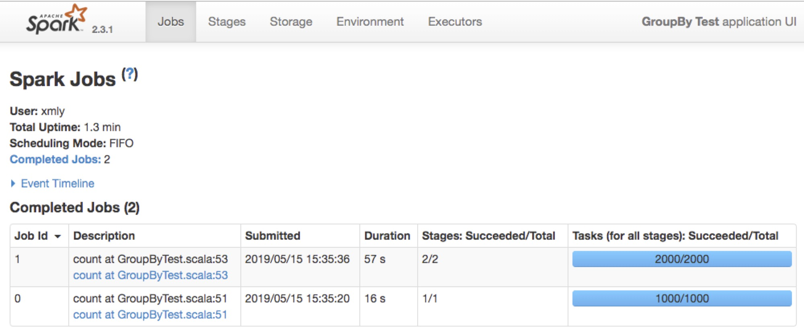
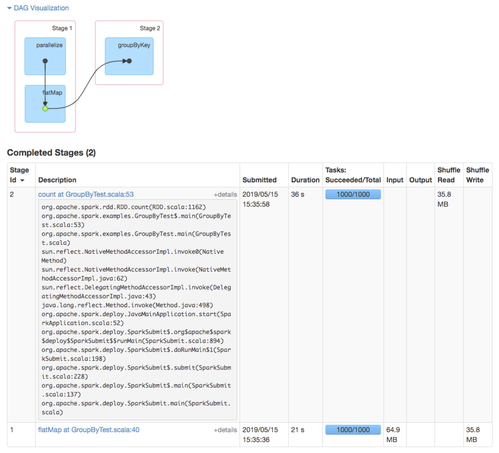
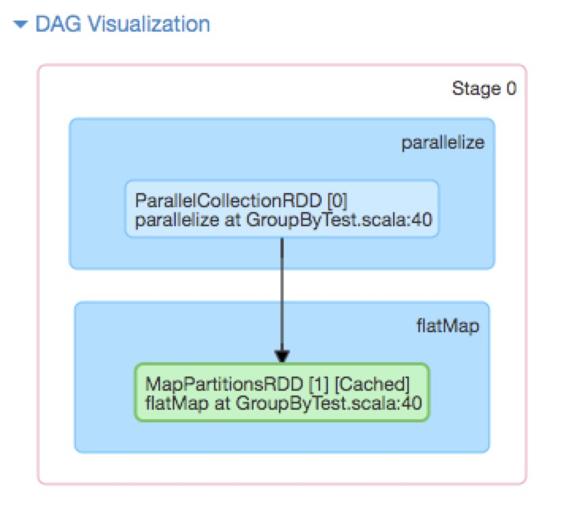

以spark自带examples里的的`GroupByTest`为例，进行分析

代码：

```scala
object GroupByTest {
  def main(args: Array[String]) {
    val spark = SparkSession
      .builder
      .appName("GroupBy Test")
      .config(new SparkConf().setMaster("local[2]"))
      .getOrCreate()

    val numMappers = if (args.length > 0) args(0).toInt else 2
    val numKVPairs = if (args.length > 1) args(1).toInt else 1000
    val valSize = if (args.length > 2) args(2).toInt else 1000
    val numReducers = if (args.length > 3) args(3).toInt else numMappers

    val pairs1 = spark.sparkContext.parallelize(0 until numMappers, numMappers).flatMap { p =>
      val ranGen = new Random
      val arr1 = new Array[(Int, Array[Byte])](numKVPairs)
      for (i <- 0 until numKVPairs) {
        val byteArr = new Array[Byte](valSize)
        ranGen.nextBytes(byteArr)
        arr1(i) = (ranGen.nextInt(Int.MaxValue), byteArr)
      }
      arr1
    }.cache()
    // Enforce that everything has been calculated and in cache
    pairs1.count()

    println(pairs1.groupByKey(numReducers).count())

    spark.stop()
  }
}
```

```shell
bin/spark-submit --master spark://localhost:7077 --jars /opt/spark/examples/jars/spark-examples_2.11-2.3.1.jar --class org.apache.spark.examples.GroupByTest 2 1000 1000 2
```
运行完后，进入18080端口，查看`Jobs`如下：

可见，被两次action操作——`count()`切割为两个job，

重点看Job Id 1，

job被`groupByKey`切分为两个stage。stage 1 进行shuffle write，stage 2 进行shuffle wirte


不执行count(), 直接执行`println(pairs1.toDebugString)`,输出
```shell
(2) MapPartitionsRDD[1] at flatMap at GroupByTest.scala:40 [Memory Deserialized 1x Replicated]
 |  ParallelCollectionRDD[0] at parallelize at GroupByTest.scala:40 [Memory Deserialized 1x Replicated]
```
可见输出并不完整（因为没有action）


先执行count，再运行`println(pairs1.toDebugString)`,输出
```shell
(2) MapPartitionsRDD[1] at flatMap at GroupByTest.scala:40 [Memory Deserialized 1x Replicated]
 |       CachedPartitions: 2; MemorySize: 2.0 MB; ExternalBlockStoreSize: 0.0 B; DiskSize: 0.0 B
 |  ParallelCollectionRDD[0] at parallelize at GroupByTest.scala:40 [Memory Deserialized 1x Replicated]
```
输出少`ShuffledRDD`

将groupByKey后的rdd重新赋值
```scala
val groupedRdd = pairs1.groupByKey()
println(groupedRdd.count())
println(groupedRdd.toDebugString)
```

输出
```shell
(2) ShuffledRDD[2] at groupByKey at GroupByTest.scala:53 []
 +-(2) MapPartitionsRDD[1] at flatMap at GroupByTest.scala:40 []
    |      CachedPartitions: 2; MemorySize: 2.0 MB; ExternalBlockStoreSize: 0.0 B; DiskSize: 0.0 B
    |  ParallelCollectionRDD[0] at parallelize at GroupByTest.scala:40 []
```

RDD.toDebugString的作用：`A description of this RDD and its recursive dependencies for debugging.`

总结：
两次count()将application分为两个job，

job0由第一个action——count()触发，只包含一个stage.包含 `numMappers` 个ResultTask。因为执行了cache,会将MapPartitionsRDD缓存到executor的内存
如下图：


task 执行完后，driver 收集每个 task 的执行结果，然后进行 sum()。job0结束

job1由第二个action——count()触发，包含两个stage(被groupByKey切分).

stage1 包含 `numMappers` 个ShuffleMapTask,进行shuffle write

stage2 包含 `numReducers` 个ResultTask，进行shuffle read，count

task 执行完后，driver 收集每个 task 的执行结果，然后进行 sum()。job1结束

---
参考

[SparkInternals 概览](https://github.com/JerryLead/SparkInternals/blob/master/markdown/1-Overview.md)