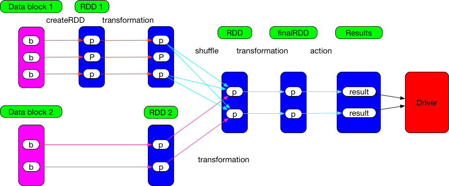

### action 与 transformation



[learn spark by an example](./learn-spark-by-an-example.md)中提到了 [transformation](http://spark.apache.org/docs/2.4.3/rdd-programming-guide.html#transformations) 和 [action](http://spark.apache.org/docs/2.4.3/rdd-programming-guide.html#actions) 两种操作，意为准换、行动。`org.apache.spark.rdd.RDD` 包含这两种算子。可以通过函数返回值来区分这两种算子：
- `transformation`：返回RDD，如map，flatMap，union等
- `action`：返回具体的值，如count，collect等

很多资料显示，transformation延迟执行，action立即执行。这是为什么呢？

以map为例：
```scala
//org.apache.spark.rdd.RDD
def map[U: ClassTag](f: T => U): RDD[U] = withScope {
    val cleanF = sc.clean(f)
    new MapPartitionsRDD[U, T](this, (context, pid, iter) => iter.map(cleanF))
}

/**
 * An RDD that applies the provided function to every partition of the parent RDD.
 */
private[spark] class MapPartitionsRDD[U: ClassTag, T: ClassTag](
    var prev: RDD[T],
    f: (TaskContext, Int, Iterator[T]) => Iterator[U],  // (TaskContext, partition index, iterator)
    preservesPartitioning: Boolean = false)
  extends RDD[U](prev) {

  override val partitioner = if (preservesPartitioning) firstParent[T].partitioner else None

  override def getPartitions: Array[Partition] = firstParent[T].partitions

  override def compute(split: Partition, context: TaskContext): Iterator[U] =
    f(context, split.index, firstParent[T].iterator(split, context))

  override def clearDependencies() {
    super.clearDependencies()
    prev = null
  }
}
```
可见，map算子只是new了一个新 `MapPartitionsRDD` 返回，并没有实际运算.

以下算子也是一样
```scala
  /**
   *  Return a new RDD by first applying a function to all elements of this
   *  RDD, and then flattening the results.
   */
  def flatMap[U: ClassTag](f: T => TraversableOnce[U]): RDD[U] = withScope {
    val cleanF = sc.clean(f)
    new MapPartitionsRDD[U, T](this, (context, pid, iter) => iter.flatMap(cleanF))
  }

  /**
   * Return a new RDD containing only the elements that satisfy a predicate.
   */
  def filter(f: T => Boolean): RDD[T] = withScope {
    val cleanF = sc.clean(f)
    new MapPartitionsRDD[T, T](
      this,
      (context, pid, iter) => iter.filter(cleanF),
      preservesPartitioning = true)
  }

  /**
   * Return a new RDD containing the distinct elements in this RDD.
   */
  def distinct(numPartitions: Int)(implicit ord: Ordering[T] = null): RDD[T] = withScope {
    map(x => (x, null)).reduceByKey((x, y) => x, numPartitions).map(_._1)
  }

  /**
   * Return a new RDD containing the distinct elements in this RDD.
   */
  def distinct(): RDD[T] = withScope {
    distinct(partitions.length)
  }
```

再来看看action
```scala
 /**
   * Return the number of elements in the RDD.
   */
  def count(): Long = sc.runJob(this, Utils.getIteratorSize _).sum

 /**
   * Applies a function f to all elements of this RDD.
   */
  def foreach(f: T => Unit): Unit = withScope {
    val cleanF = sc.clean(f)
    sc.runJob(this, (iter: Iterator[T]) => iter.foreach(cleanF))
  }

  /**
   * Applies a function f to each partition of this RDD.
   */
  def foreachPartition(f: Iterator[T] => Unit): Unit = withScope {
    val cleanF = sc.clean(f)
    sc.runJob(this, (iter: Iterator[T]) => cleanF(iter))
  }

  /**
   * Return an array that contains all of the elements in this RDD.
   *
   * @note This method should only be used if the resulting array is expected to be small, as
   * all the data is loaded into the driver's memory.
   */
  def collect(): Array[T] = withScope {
    val results = sc.runJob(this, (iter: Iterator[T]) => iter.toArray)
    Array.concat(results: _*)
  }
```

可以看到，action本质上都在调用`SparkContext`的`runJob`方法,在RDD的所有partition上运行一个job，返回一个数组，每个元素包含一个partition的结果
```scala
  /**
   * Run a job on all partitions in an RDD and return the results in an array.
   *
   * @param rdd target RDD to run tasks on
   * @param func a function to run on each partition of the RDD
   * @return in-memory collection with a result of the job (each collection element will contain
   * a result from one partition)
   */
  def runJob[T, U: ClassTag](rdd: RDD[T], func: Iterator[T] => U): Array[U] = {
    runJob(rdd, func, 0 until rdd.partitions.length)
  }
```
`SparkContext`后面有空再讲

### dependency
dependency表示RDD之间的依赖关系,类图如下


RDD的构造函数里有dependency.可通过构造函数，判断是什么依赖

```scala
abstract class RDD[T: ClassTag](
    @transient private var _sc: SparkContext,
    @transient private var deps: Seq[Dependency[_]]
  )
```

ShuffleDependency: 父RDD中的每个partition分成多个部分transformation到子RDD，reducebyKey等

OneToOneDependency: 1对1，map，mapPartitions等

RangeDependency: 仅用于`UnionRDD`

PruneDependency: `PartitionPruningRDD`  prune意为修剪

例如: RDD通过range分区，DAG在key上有filter，range不覆盖key的分区不用发起任务

```scala
/**
 * :: DeveloperApi ::
 * An RDD used to prune RDD partitions/partitions so we can avoid launching tasks on
 * all partitions. An example use case: If we know the RDD is partitioned by range,
 * and the execution DAG has a filter on the key, we can avoid launching tasks
 * on partitions that don't have the range covering the key.
 */
@DeveloperApi
class PartitionPruningRDD[T: ClassTag](
    prev: RDD[T],
    partitionFilterFunc: Int => Boolean)
  extends RDD[T](prev.context, List(new PruneDependency(prev, partitionFilterFunc))) {

  override def compute(split: Partition, context: TaskContext): Iterator[T] = {
    firstParent[T].iterator(
      split.asInstanceOf[PartitionPruningRDDPartition].parentSplit, context)
  }

  override protected def getPartitions: Array[Partition] =
    dependencies.head.asInstanceOf[PruneDependency[T]].partitions
}
```
