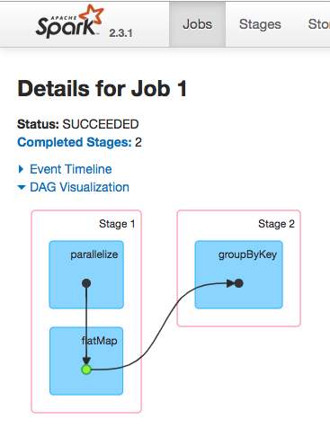

### where are `withScope {}` and `sc.clean(f)`

在`RDD`中，充斥着大量的 `withScope {}`,`sc.clean(f)`。如下所示：
```scala
  /**
   * Return a new RDD by applying a function to all elements of this RDD.
   */
  def map[U: ClassTag](f: T => U): RDD[U] = withScope {
    val cleanF = sc.clean(f)
    new MapPartitionsRDD[U, T](this, (context, pid, iter) => iter.map(cleanF))
  }

  /**
   *  Return a new RDD by first applying a function to all elements of this
   *  RDD, and then flattening the results.
   */
  def flatMap[U: ClassTag](f: T => TraversableOnce[U]): RDD[U] = withScope {
    val cleanF = sc.clean(f)
    new MapPartitionsRDD[U, T](this, (context, pid, iter) => iter.flatMap(cleanF))
  }

  /**
   * Return a new RDD containing only the elements that satisfy a predicate.
   */
  def filter(f: T => Boolean): RDD[T] = withScope {
    val cleanF = sc.clean(f)
    new MapPartitionsRDD[T, T](
      this,
      (context, pid, iter) => iter.filter(cleanF),
      preservesPartitioning = true)
  }
```
大多数情况下，这两个function不影响你阅读源码。但仍有必要弄懂它们是干什么的！

### withScope {}

org.apache.spark.rdd.RDD
```scala
  /**
   * Execute a block of code in a scope such that all new RDDs created in this body will
   * be part of the same scope. For more detail, see {{org.apache.spark.rdd.RDDOperationScope}}.
   *
   * Note: Return statements are NOT allowed in the given body.
   *
   * 在scope中执行代码块，这样所有body中创建的RDDs会成为相同scope的一部分。
   * 详见 {{org.apache.spark.rdd.RDDOperationScope}}
   *
   * 注意：给定body中不允许有return语句
   */
  private[spark] def withScope[U](body: => U): U = RDDOperationScope.withScope[U](sc)(body)
```

源码及解析如下
```scala
package org.apache.spark.rdd

import java.util.concurrent.atomic.AtomicInteger

import com.fasterxml.jackson.annotation.{JsonIgnore, JsonInclude, JsonPropertyOrder}
import com.fasterxml.jackson.annotation.JsonInclude.Include
import com.fasterxml.jackson.databind.ObjectMapper
import com.fasterxml.jackson.module.scala.DefaultScalaModule
import com.google.common.base.Objects

import org.apache.spark.SparkContext
import org.apache.spark.internal.Logging

/**
  * A general, named code block representing an operation that instantiates RDDs.
  *
  * All RDDs instantiated in the corresponding code block will store a pointer to this object.
  * Examples include, but will not be limited to, existing RDD operations, such as textFile,
  * reduceByKey, and treeAggregate.
  *
  * An operation scope may be nested in other scopes. For instance, a SQL query may enclose
  * scopes associated with the public RDD APIs it uses under the hood.
  *
  * There is no particular relationship between an operation scope and a stage or a job.
  * A scope may live inside one stage (e.g. map) or span across multiple jobs (e.g. take).
  *
  * 一个通用的、被命名的代码块表示一个实例化RDDs的操作(就是spark算子)。
  *
  * 在相应代码块中示例化的所有RDDs将存储指向该对象的指针(就是指向spark算子)。
  * 包括但不限于已存在的RDD operation,如textFile,reduceByKey, and treeAggregate.
  *
  * 一个操作的scope可能嵌入其他scopes。例如，一个SQL查询可能包含它在hood(引擎盖，有sql执行引擎之说)下使用的public RDD APIs关联的scope。
  *
  * 操作的scope与stage、job之间没有特别的关联。scope可能只存活于一个stage(例如map)，或跨多个jobs(如take)
  */
@JsonInclude(Include.NON_NULL)
@JsonPropertyOrder(Array("id", "name", "parent"))
private[spark] class RDDOperationScope(
                                        val name: String,
                                        val parent: Option[RDDOperationScope] = None,
                                        val id: String = RDDOperationScope.nextScopeId().toString) {//id自增

  def toJson: String = {
    RDDOperationScope.jsonMapper.writeValueAsString(this)
  }

  /**
    * Return a list of scopes that this scope is a part of, including this scope itself.
    * The result is ordered from the outermost scope (eldest ancestor) to this scope.
    *
    * 返回scopes的list，包含本scope。结果按照从最外层的scope(最老的祖先)到本scope的顺序排序
    */
  @JsonIgnore
  def getAllScopes: Seq[RDDOperationScope] = {
    parent.map(_.getAllScopes).getOrElse(Seq.empty) ++ Seq(this)
  }

  override def equals(other: Any): Boolean = {
    other match {
      case s: RDDOperationScope =>
        id == s.id && name == s.name && parent == s.parent
      case _ => false
    }
  }

  override def hashCode(): Int = Objects.hashCode(id, name, parent)

  override def toString: String = toJson
}

/**
  * A collection of utility methods to construct a hierarchical representation of RDD scopes.
  * An RDD scope tracks the series of operations that created a given RDD.
  *
  * 工具方法的集合，来构造RDD scopes的分层表示.
  * 一个RDD scope追踪创建给定RDD的一系列算子.
  */
private[spark] object RDDOperationScope extends Logging {
  private val jsonMapper = new ObjectMapper().registerModule(DefaultScalaModule)
  private val scopeCounter = new AtomicInteger(0)

  def fromJson(s: String): RDDOperationScope = {
    jsonMapper.readValue(s, classOf[RDDOperationScope])
  }

  /** Return a globally unique operation scope ID. 返回全局唯一的operation scope ID*/
  def nextScopeId(): Int = scopeCounter.getAndIncrement

  /**
    * Execute the given body such that all RDDs created in this body will have the same scope.
    * The name of the scope will be the first method name in the stack trace that is not the
    * same as this method's.
    *
    * Note: Return statements are NOT allowed in body.
    *
    * 执行给定的body，body中创建的所有RDDs将会拥有相同的scope。scope的名字是调用链里第一个不是"withScope"的方法的名字。
    *
    * 注意:body不允许return声明
    */
  private[spark] def withScope[T](
                                   sc: SparkContext,
                                   allowNesting: Boolean = false)(body: => T): T = {
    val ourMethodName = "withScope"
    val callerMethodName = Thread.currentThread.getStackTrace()//调用链 倒序
      .dropWhile(_.getMethodName != ourMethodName)
      .find(_.getMethodName != ourMethodName)
      .map(_.getMethodName)
      .getOrElse {
        // Log a warning just in case, but this should almost certainly never happen
        logWarning("No valid method name for this RDD operation scope!")
        "N/A"
      }
    withScope[T](sc, callerMethodName, allowNesting, ignoreParent = false)(body)
  }

  /**
    * Execute the given body such that all RDDs created in this body will have the same scope.
    *
    * 执行给定的body，body里创建的RDDs都拥有相同的scope
    *
    * If nesting is allowed, any subsequent calls to this method in the given body will instantiate
    * child scopes that are nested within our scope. Otherwise, these calls will take no effect.
    *
    * 如果允许嵌套，body中方法的后续调用(withScope)将实例化子scopes，子scopes都嵌套在我们的scope中。否则，调用没有影响
    *
    * Additionally, the caller of this method may optionally ignore the configurations and scopes
    * set by the higher level caller. In this case, this method will ignore the parent caller's
    * intention to disallow nesting, and the new scope instantiated will not have a parent. This
    * is useful for scoping physical operations in Spark SQL, for instance.
    *
    * 另外，方法的调用者可选择忽略被 更高层调用者 设定的配置和scopes。这种情况下，方法将忽略父调用者禁止嵌套的意图，新的实例化
    * 的scope将不再有parent。这对在spark sql中的物理operations很有作用
    *
    * Note: Return statements are NOT allowed in body.
    *
    * 此方法会嵌套执行，body里面会套body
    */
  private[spark] def withScope[T](
                                   sc: SparkContext,
                                   name: String,
                                   allowNesting: Boolean,
                                   ignoreParent: Boolean)(body: => T): T = {
    // Save the old scope to restore it later 保存老的scope，便于后面恢复
    val scopeKey = SparkContext.RDD_SCOPE_KEY
    val noOverrideKey = SparkContext.RDD_SCOPE_NO_OVERRIDE_KEY
    val oldScopeJson = sc.getLocalProperty(scopeKey)//从ThreadLocal中获取
    val oldScope = Option(oldScopeJson).map(RDDOperationScope.fromJson)//json反序列化
    val oldNoOverride = sc.getLocalProperty(noOverrideKey)//从ThreadLocal中获取
    try {
      if (ignoreParent) {//忽略父scope
        // Ignore all parent settings and scopes and start afresh with our own root scope
        sc.setLocalProperty(scopeKey, new RDDOperationScope(name).toJson)//忽略parent settings and scopes，开始新的root scope
      } else if (sc.getLocalProperty(noOverrideKey) == null) {//allowNesting == true 或 当前thread第一次执行withScope，此时oldScope为 None
        // Otherwise, set the scope only if the higher level caller allows us to do so
        sc.setLocalProperty(scopeKey, new RDDOperationScope(name, oldScope).toJson)//保存父scope
      }
      // Optionally disallow the child body to override our scope
      if (!allowNesting) {
        sc.setLocalProperty(noOverrideKey, "true")
      }
      body//执行body  如果allowNesting ignoreParent都为false  则只执行body，scope保持不变
    } finally {
      // Remember to restore any state that was modified before exiting 恢复状态
      sc.setLocalProperty(scopeKey, oldScopeJson)
      sc.setLocalProperty(noOverrideKey, oldNoOverride)
    }
  }
}
```
其核心功能，是将RDDOperationScope对象放入ThreadLocal,name是withScope前的函数名.

可用来做DAG可视化  DAG visualization on SparkUI。如[learn spark by an example](./learn-spark-by-an-example.md)的SparkUI



### sc.clean(f)

作用：闭包清理，降低网络io,提高executor的内存效率

在spark分布式环境中，如果引用的外部变量不可序列化，就不能正确发送到worker节点上去。一些没有用到的引用不需要发送到worker上.`ClosureCleaner.clean()`通过递归遍历闭包里面的引用，检查不能serializable的, 去除unused的引用；

分析：

1. 闭包：函数引用了外部变量。

2. 源码解析

```scala

/**
  * Clean a closure to make it ready to be serialized and sent to tasks
  * (removes unreferenced variables in $outer's, updates REPL variables)
  * If <tt>checkSerializable</tt> is set, <tt>clean</tt> will also proactively
  * check to see if <tt>f</tt> is serializable and throw a <tt>SparkException</tt>
  * if not.
  *
  * 清理一个闭包，让它可以被序列化并发送给tasks（删除未引用的外部变量、更新的REPL变量）
  * 如果checkSerializable被设定，clean方法将主动主动检查函数f是否可序列化。否则抛出SparkException
  *
  * @param f the closure to clean
  * @param checkSerializable whether or not to immediately check <tt>f</tt> for serializability
  * @throws SparkException if <tt>checkSerializable</tt> is set but <tt>f</tt> is not
  *   serializable
  * @return the cleaned closure
  */
  private[spark] def clean[F <: AnyRef](f: F, checkSerializable: Boolean = true): F = {
    ClosureCleaner.clean(f, checkSerializable)
    f
  }
```

`org.apache.spark.util.ClosureCleaner`
```scala
  private def clean(
      func: AnyRef,
      checkSerializable: Boolean,
      cleanTransitively: Boolean,
      accessedFields: Map[Class[_], Set[String]]): Unit = {
    源码看不懂
  }
```


---
[What does Closure.cleaner (func) mean in Spark?](https://www.quora.com/What-does-Closure-cleaner-func-mean-in-Spark)

[Spark源码分析之ClosureCleaner](https://www.jianshu.com/p/51f5a34e2785)(推荐，有反编译)

[spark: ClosureCleaner.clean()](https://www.cnblogs.com/ivanny/p/spark_ClosureCleaner_clean_function.html)
