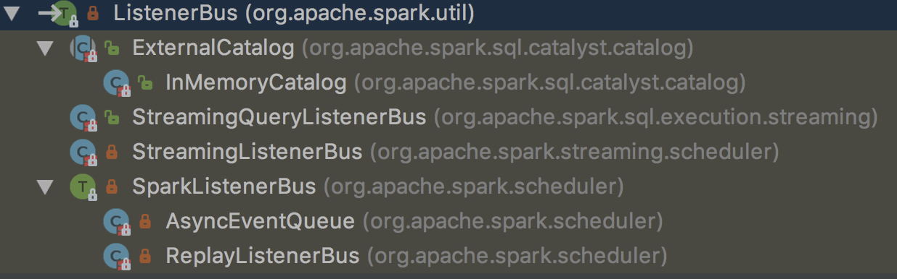

### ListenerBus
spark有一个trait——`ListenerBus`,事件总线，把事件提交给监听器
```scala
/**
 * An event bus which posts events to its listeners.
 */
private[spark] trait ListenerBus[L <: AnyRef, E] extends Logging {

  private[this] val listenersPlusTimers = new CopyOnWriteArrayList[(L, Option[Timer])]

  // Marked `private[spark]` for access in tests.
  private[spark] def listeners = listenersPlusTimers.asScala.map(_._1).asJava

  /**
   * Returns a CodaHale metrics Timer for measuring the listener's event processing time.
   * This method is intended to be overridden by subclasses.
   */
  protected def getTimer(listener: L): Option[Timer] = None

  /**
   * Add a listener to listen events. This method is thread-safe and can be called in any thread.
   */
  final def addListener(listener: L): Unit = {
    listenersPlusTimers.add((listener, getTimer(listener)))
  }

  /**
   * Remove a listener and it won't receive any events. This method is thread-safe and can be called
   * in any thread.
   */
  final def removeListener(listener: L): Unit = {
    listenersPlusTimers.asScala.find(_._1 eq listener).foreach { listenerAndTimer =>
      listenersPlusTimers.remove(listenerAndTimer)
    }
  }

  /**
   * This can be overriden by subclasses if there is any extra cleanup to do when removing a
   * listener.  In particular AsyncEventQueues can clean up queues in the LiveListenerBus.
   */
  def removeListenerOnError(listener: L): Unit = {
    removeListener(listener)
  }


  /**
   * Post the event to all registered listeners. The `postToAll` caller should guarantee calling
   * `postToAll` in the same thread for all events.
   */
  def postToAll(event: E): Unit = {
    // JavaConverters can create a JIterableWrapper if we use asScala.
    // However, this method will be called frequently. To avoid the wrapper cost, here we use
    // Java Iterator directly.
    val iter = listenersPlusTimers.iterator
    while (iter.hasNext) {
      val listenerAndMaybeTimer = iter.next()
      val listener = listenerAndMaybeTimer._1
      val maybeTimer = listenerAndMaybeTimer._2
      val maybeTimerContext = if (maybeTimer.isDefined) {
        maybeTimer.get.time()
      } else {
        null
      }
      try {
        doPostEvent(listener, event)
        if (Thread.interrupted()) {
          // We want to throw the InterruptedException right away so we can associate the interrupt
          // with this listener, as opposed to waiting for a queue.take() etc. to detect it.
          //一旦监听器中断，立即抛异常。而不是等待queue.take()等等，来发现中断
          throw new InterruptedException()
        }
      } catch {
        case ie: InterruptedException =>
          logError(s"Interrupted while posting to ${Utils.getFormattedClassName(listener)}.  " +
            s"Removing that listener.", ie)
          removeListenerOnError(listener)//删除监听器，线程安全
        case NonFatal(e) =>
          logError(s"Listener ${Utils.getFormattedClassName(listener)} threw an exception", e)
      } finally {
        if (maybeTimerContext != null) {
          maybeTimerContext.stop()
        }
      }
    }
  }

  /**
   * Post an event to the specified listener. `onPostEvent` is guaranteed to be called in the same
   * thread for all listeners.
   * 具体对待提交的事件。留给子类继承
   */
  protected def doPostEvent(listener: L, event: E): Unit

  private[spark] def findListenersByClass[T <: L : ClassTag](): Seq[T] = {
    val c = implicitly[ClassTag[T]].runtimeClass
    listeners.asScala.filter(_.getClass == c).map(_.asInstanceOf[T]).toSeq
  }

}
```
主要依靠`CopyOnWriteArrayList`保障线程安全，主动发现`InterruptedException`，而不是被动等待。具体的操作，留给子类实现`doPostEvent`

### ListenerBus的继承体系



#### SparkListenerBus
```scala
private[spark] trait SparkListenerBus
  extends ListenerBus[SparkListenerInterface, SparkListenerEvent] {

  protected override def doPostEvent(
      listener: SparkListenerInterface,
      event: SparkListenerEvent): Unit = {
    event match {
      case stageSubmitted: SparkListenerStageSubmitted =>
        listener.onStageSubmitted(stageSubmitted)
      case stageCompleted: SparkListenerStageCompleted =>
        listener.onStageCompleted(stageCompleted)
      case jobStart: SparkListenerJobStart =>
        listener.onJobStart(jobStart)
      ...
      case speculativeTaskSubmitted: SparkListenerSpeculativeTaskSubmitted =>
        listener.onSpeculativeTaskSubmitted(speculativeTaskSubmitted)
      case _ => listener.onOtherEvent(event)
    }
  }

}
```
`SparkListenerBus`根据模式匹配，根据不同的`SparkListenerEvent`,调用`SparkListenerInterface`的不同方法.doPostEvents是同步调用的，当调度频繁时，可能导致`写入延迟，事件丢失`

##### SparkListenerInterface
```scala
private[spark] trait SparkListenerInterface {

  /**
   * Called when a stage completes successfully or fails, with information on the completed stage.
   */
  def onStageCompleted(stageCompleted: SparkListenerStageCompleted): Unit

  /**
   * Called when a stage is submitted
   */
  def onStageSubmitted(stageSubmitted: SparkListenerStageSubmitted): Unit

  ...
}
```
官方建议继承`SparkListener`or `SparkFirehoseListener`，而不是直接实现`SparkListenerInterface`

```scala
//空实现
abstract class SparkListener extends SparkListenerInterface {
  override def onStageCompleted(stageCompleted: SparkListenerStageCompleted): Unit = { }

  override def onStageSubmitted(stageSubmitted: SparkListenerStageSubmitted): Unit = { }

  override def onTaskStart(taskStart: SparkListenerTaskStart): Unit = { }

  ...

}

//子类只需要重写onEvent一个方法即可
public class SparkFirehoseListener implements SparkListenerInterface {

  public void onEvent(SparkListenerEvent event) { }

  @Override
  public final void onStageCompleted(SparkListenerStageCompleted stageCompleted) {
    onEvent(stageCompleted);
  }

  @Override
  public final void onStageSubmitted(SparkListenerStageSubmitted stageSubmitted) {
    onEvent(stageSubmitted);
  }

  ...
}
```

##### SparkListenerEvent
```scala
@DeveloperApi
@JsonTypeInfo(use = JsonTypeInfo.Id.CLASS, include = JsonTypeInfo.As.PROPERTY, property = "Event")
trait SparkListenerEvent {
  /* Whether output this event to the event log */
  protected[spark] def logEvent: Boolean = true
}

@DeveloperApi
case class SparkListenerStageSubmitted(stageInfo: StageInfo, properties: Properties = null)
  extends SparkListenerEvent

@DeveloperApi
case class SparkListenerStageCompleted(stageInfo: StageInfo) extends SparkListenerEvent

@DeveloperApi
case class SparkListenerTaskStart(stageId: Int, stageAttemptId: Int, taskInfo: TaskInfo)
  extends SparkListenerEvent
...
}
```

#### AsyncEventQueue

```scala
/**
 * An asynchronous queue for events. All events posted to this queue will be delivered to the child
 * listeners in a separate thread.
 * 所有提交到队列里的事件将在单独的线程里运行
 * Delivery will only begin when the `start()` method is called. The `stop()` method should be
 * called when no more events need to be delivered.
 */
private class AsyncEventQueue(
    val name: String,
    conf: SparkConf,
    metrics: LiveListenerBusMetrics,
    bus: LiveListenerBus)
  extends SparkListenerBus
  with Logging {

  import AsyncEventQueue._

  // Cap the capacity of the queue so we get an explicit error (rather than an OOM exception) if
  // it's perpetually being added to more quickly than it's being drained.
  //限定大小，避免OOM。事件先提交到这个队列
  private val eventQueue = new LinkedBlockingQueue[SparkListenerEvent](
    conf.get(LISTENER_BUS_EVENT_QUEUE_CAPACITY))

  // Keep the event count separately, so that waitUntilEmpty() can be implemented properly;
  // this allows that method to return only when the events in the queue have been fully
  // processed (instead of just dequeued).
  private val eventCount = new AtomicLong()

  /** A counter for dropped events. It will be reset every time we log it. */
  private val droppedEventsCounter = new AtomicLong(0L)

  /** When `droppedEventsCounter` was logged last time in milliseconds. */
  @volatile private var lastReportTimestamp = 0L

  private val logDroppedEvent = new AtomicBoolean(false)

  private var sc: SparkContext = null

  private val started = new AtomicBoolean(false)
  private val stopped = new AtomicBoolean(false)

  private val droppedEvents = metrics.metricRegistry.counter(s"queue.$name.numDroppedEvents")
  private val processingTime = metrics.metricRegistry.timer(s"queue.$name.listenerProcessingTime")

  // Remove the queue size gauge first, in case it was created by a previous incarnation of
  // this queue that was removed from the listener bus.
  metrics.metricRegistry.remove(s"queue.$name.size")
  metrics.metricRegistry.register(s"queue.$name.size", new Gauge[Int] {
    override def getValue: Int = eventQueue.size()
  })

  private val dispatchThread = new Thread(s"spark-listener-group-$name") {//dispatch在单独线程里运行
    setDaemon(true)
    override def run(): Unit = Utils.tryOrStopSparkContext(sc) {//出了异常，将在新线程里关闭SparkContext
      dispatch()
    }
  }

  private def dispatch(): Unit = LiveListenerBus.withinListenerThread.withValue(true) {
    var next: SparkListenerEvent = eventQueue.take()//阻塞，直到取出元素
    while (next != POISON_PILL) {//毒丸，优雅的关闭dispatchThread，类似于akka关闭actor
      val ctx = processingTime.time()
      try {
        super.postToAll(next)//提交任务
      } finally {
        ctx.stop()
      }
      eventCount.decrementAndGet()
      next = eventQueue.take()
    }
    eventCount.decrementAndGet()
  }

  override protected def getTimer(listener: SparkListenerInterface): Option[Timer] = {
    metrics.getTimerForListenerClass(listener.getClass.asSubclass(classOf[SparkListenerInterface]))
  }

  /**
   * Start an asynchronous thread to dispatch events to the underlying listeners.
   *
   * @param sc Used to stop the SparkContext in case the async dispatcher fails.
   */
  private[scheduler] def start(sc: SparkContext): Unit = {
    if (started.compareAndSet(false, true)) {
      this.sc = sc
      dispatchThread.start()//线程开始从队列取出事件并提交
    } else {
      throw new IllegalStateException(s"$name already started!")
    }
  }

  /**
   * Stop the listener bus. It will wait until the queued events have been processed, but new
   * events will be dropped.
   * 等待已入队的事件被处理，新事件将被丢弃
   */
  private[scheduler] def stop(): Unit = {
    if (!started.get()) {
      throw new IllegalStateException(s"Attempted to stop $name that has not yet started!")
    }
    if (stopped.compareAndSet(false, true)) {
      eventCount.incrementAndGet()
      eventQueue.put(POISON_PILL)
    }
    // this thread might be trying to stop itself as part of error handling -- we can't join
    // in that case.
    if (Thread.currentThread() != dispatchThread) {
      dispatchThread.join()
    }
  }

  def post(event: SparkListenerEvent): Unit = {//public方法
    if (stopped.get()) {
      return
    }

    eventCount.incrementAndGet()
    if (eventQueue.offer(event)) {//提交到异步队列，立即返回，不阻塞
      return
    }

    eventCount.decrementAndGet()
    droppedEvents.inc()
    droppedEventsCounter.incrementAndGet()
    if (logDroppedEvent.compareAndSet(false, true)) {
      // Only log the following message once to avoid duplicated annoying logs.
      logError(s"Dropping event from queue $name. " +
        "This likely means one of the listeners is too slow and cannot keep up with " +
        "the rate at which tasks are being started by the scheduler.")
    }
    logTrace(s"Dropping event $event")

    val droppedCount = droppedEventsCounter.get
    if (droppedCount > 0) {
      // Don't log too frequently
      if (System.currentTimeMillis() - lastReportTimestamp >= 60 * 1000) {//打印抛弃事件的数量
        // There may be multiple threads trying to decrease droppedEventsCounter.
        // Use "compareAndSet" to make sure only one thread can win.
        // And if another thread is increasing droppedEventsCounter, "compareAndSet" will fail and
        // then that thread will update it.
        if (droppedEventsCounter.compareAndSet(droppedCount, 0)) {
          val prevLastReportTimestamp = lastReportTimestamp
          lastReportTimestamp = System.currentTimeMillis()
          val previous = new java.util.Date(prevLastReportTimestamp)
          logWarning(s"Dropped $droppedCount events from $name since $previous.")
        }
      }
    }
  }

  /**
   * For testing only. Wait until there are no more events in the queue.
   *
   * @return true if the queue is empty.
   */
  def waitUntilEmpty(deadline: Long): Boolean = {
    while (eventCount.get() != 0) {
      if (System.currentTimeMillis > deadline) {
        return false
      }
      Thread.sleep(10)
    }
    true
  }

  override def removeListenerOnError(listener: SparkListenerInterface): Unit = {
    // the listener failed in an unrecoverably way, we want to remove it from the entire
    // LiveListenerBus (potentially stopping a queue if it is empty)
    bus.removeListener(listener)
  }

}

private object AsyncEventQueue {

  val POISON_PILL = new SparkListenerEvent() { }//毒丸，优雅地关闭线程

}
```
AsyncEventQueue中的`dispatch`方法，会调用`LiveListenerBus#LiveListenerBus.withinListenerThread.withValue`方法，removeListenerOnError实际调用`LiveListenerBus#removeListener`方法。`stop`方法不会中断线程，会等待线程执行完，但不接受新事件

#### LiveListenerBus

```scala
/**
 * SparkListenerEvents
 * Asynchronously passes SparkListenerEvents to registered SparkListeners.
 *
 * Until `start()` is called, all posted events are only buffered. Only after this listener bus
 * has started will events be actually propagated to all attached listeners. This listener bus
 * is stopped when `stop()` is called, and it will drop further events after stopping.
 */
private[spark] class LiveListenerBus(conf: SparkConf) {
...
  /**
   * 将监听器加到指定的queue(通过队列的名字)
   * Add a listener to a specific queue, creating a new queue if needed. Queues are independent
   * of each other (each one uses a separate thread for delivering events), allowing slower
   * listeners to be somewhat isolated from others.
   */
  private[spark] def addToQueue(
      listener: SparkListenerInterface,
      queue: String): Unit = synchronized {
    if (stopped.get()) {
      throw new IllegalStateException("LiveListenerBus is stopped.")
    }

    queues.asScala.find(_.name == queue) match {
      case Some(queue) =>
        queue.addListener(listener)

      case None =>
        val newQueue = new AsyncEventQueue(queue, conf, metrics, this)
        newQueue.addListener(listener)
        if (started.get()) {
          newQueue.start(sparkContext)
        }
        queues.add(newQueue)
    }
  }

  def removeListener(listener: SparkListenerInterface): Unit = synchronized {
    // Remove listener from all queues it was added to, and stop queues that have become empty.
    queues.asScala
      .filter { queue =>
        queue.removeListener(listener)
        queue.listeners.isEmpty()
      }
      .foreach { toRemove =>
        if (started.get() && !stopped.get()) {
          toRemove.stop()
        }
        queues.remove(toRemove)//监听器空了的queue要stop，并移除
      }
  }

  /** Post an event to all queues. */
  def post(event: SparkListenerEvent): Unit = {
    if (stopped.get()) {
      return
    }

    metrics.numEventsPosted.inc()

    // If the event buffer is null, it means the bus has been started and we can avoid
    // synchronization and post events directly to the queues. This should be the most
    // common case during the life of the bus.
    if (queuedEvents == null) {
      postToQueues(event)
      return
    }

    // Otherwise, need to synchronize to check whether the bus is started, to make sure the thread
    // calling start() picks up the new event.
    synchronized {
      if (!started.get()) {
        queuedEvents += event
        return
      }
    }

    // If the bus was already started when the check above was made, just post directly to the
    // queues.
    postToQueues(event)
  }

  private def postToQueues(event: SparkListenerEvent): Unit = {
    val it = queues.iterator()
    while (it.hasNext()) {
      it.next().post(event)
    }
  }

}


private[spark] object LiveListenerBus {
  // Allows for Context to check whether stop() call is made within listener thread
  val withinListenerThread: DynamicVariable[Boolean] = new DynamicVariable[Boolean](false)

  private[scheduler] val SHARED_QUEUE = "shared"

  private[scheduler] val APP_STATUS_QUEUE = "appStatus"

  private[scheduler] val EXECUTOR_MANAGEMENT_QUEUE = "executorManagement"

  private[scheduler] val EVENT_LOG_QUEUE = "eventLog"
}

class DynamicVariable[T](init: T) {
  private val tl = new InheritableThreadLocal[T] {
    override def initialValue = init.asInstanceOf[T with AnyRef]
  }

  /** Retrieve the current value */
  def value: T = tl.get.asInstanceOf[T]

  /** Set the value of the variable while executing the specified
    * thunk.
    *
    * @param newval The value to which to set the variable
    * @param thunk The code to evaluate under the new setting
    */
  def withValue[S](newval: T)(thunk: => S): S = {
    val oldval = value
    tl set newval

    try thunk
    finally tl set oldval
  }

  /** Change the currently bound value, discarding the old value.
    * Usually withValue() gives better semantics.
    */
  def value_=(newval: T) = tl set newval

  override def toString: String = "DynamicVariable(" + value + ")"
}
```
`withValue`里对threadlocal的操作，和 [RDD.withScope](../../17/spark-withScope-and-clean/)有异曲同工之妙


DAGScheduler、SparkContext等都是LiveListenerBus的事件来源，它们都是通过调用LiveListenerBus的post方法将消息交给异步线程listenerThread处理


