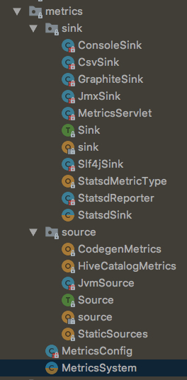
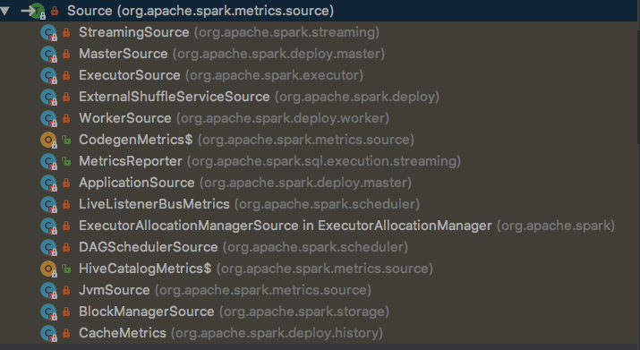
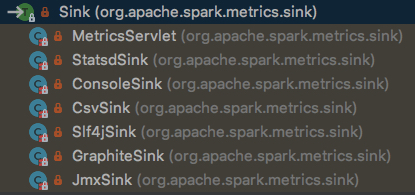

### 概览
度量，metric，及对系统运行过程中的状态进行收集统计，如性能、数据等，方便开发者了解状况，针对性优化等。

spark使用[metrics](../../../../2019/05/23/metrics/)进行监控

spark中，度量有3个概念：
- Instance:度量系统的实例名。Spark按照Instance的不同，分为Master、Worker、Application、Driver和Executor
- Source:数据来源，WorkerSource，DAGSchedulerSource，BlockManagerSource等
- Sink:数据输出，MetricsServlet，ConsoleSink，Slf4jSink等

这些概念和[flume]()类似


```scala
/**
 * Spark Metrics System, created by a specific "instance", combined by source,
 * sink, periodically polls source metrics data to sink destinations.
 *
 * "instance" specifies "who" (the role) uses the metrics system. In Spark, there are several roles
 * like master, worker, executor, client driver. These roles will create metrics system
 * for monitoring. So, "instance" represents these roles. Currently in Spark, several instances
 * have already implemented: master, worker, executor, driver, applications.
 *
 * "source" specifies "where" (source) to collect metrics data from. In metrics system, there exists
 * two kinds of source:
 *   1. Spark internal source, like MasterSource, WorkerSource, etc, which will collect
 *   Spark component's internal state, these sources are related to instance and will be
 *   added after a specific metrics system is created.
 *   2. Common source, like JvmSource, which will collect low level state, is configured by
 *   configuration and loaded through reflection.
 *
 * "sink" specifies "where" (destination) to output metrics data to. Several sinks can
 * coexist and metrics can be flushed to all these sinks.
 *
 * Metrics configuration format is like below:
 * [instance].[sink|source].[name].[options] = xxxx
 *
 * [instance] can be "master", "worker", "executor", "driver", "applications" which means only
 * the specified instance has this property.
 * wild card "*" can be used to replace instance name, which means all the instances will have
 * this property.
 *
 * [sink|source] means this property belongs to source or sink. This field can only be
 * source or sink.
 *
 * [name] specify the name of sink or source, if it is custom defined.
 *
 * [options] represent the specific property of this source or sink.
 */
private[spark] class MetricsSystem private (
    val instance: String,
    conf: SparkConf,
    securityMgr: SecurityManager)
  extends Logging {
}
```
`MetricsSystem`的注释也很好的说明了这些

下图是`org.apache.spark.metrics`包下的内容


### source

```scala
private[spark] trait Source {
  def sourceName: String // source名称
  def metricRegistry: MetricRegistry // metric注册表
}
```
MetricRegistry是`metrics`的内容，暂时只需要知道它维护了一个<String, Metric>注册表
```java
ConcurrentMap<String, Metric> metrics
```

Source功能比较简单，以`DAGSchedulerSource`为例
```java
private[scheduler] class DAGSchedulerSource(val dagScheduler: DAGScheduler)
    extends Source {
  override val metricRegistry = new MetricRegistry()
  override val sourceName = "DAGScheduler"

  metricRegistry.register(MetricRegistry.name("stage", "failedStages"), new Gauge[Int] {
    override def getValue: Int = dagScheduler.failedStages.size
  })

  metricRegistry.register(MetricRegistry.name("stage", "runningStages"), new Gauge[Int] {
    override def getValue: Int = dagScheduler.runningStages.size
  })

  metricRegistry.register(MetricRegistry.name("stage", "waitingStages"), new Gauge[Int] {
    override def getValue: Int = dagScheduler.waitingStages.size
  })

  metricRegistry.register(MetricRegistry.name("job", "allJobs"), new Gauge[Int] {
    override def getValue: Int = dagScheduler.numTotalJobs
  })

  metricRegistry.register(MetricRegistry.name("job", "activeJobs"), new Gauge[Int] {
    override def getValue: Int = dagScheduler.activeJobs.size
  })

  /** Timer that tracks the time to process messages in the DAGScheduler's event loop */
  val messageProcessingTimer: Timer =
    metricRegistry.timer(MetricRegistry.name("messageProcessingTime"))
}
```
主要做的，就是定义`sourceName`，新构造`MetricRegistry`，然后注册<String name, T extends Metric>到`metrics:ConcurrentMap[String, Metric]`注册表

Gauge输出的内容通常是`Source`构造函数入参的属性，本例中，就是dagScheduler.numTotalJobs、dagScheduler.activeJobs.size

### sink
source有了数据，还要考虑怎么输出数据，以便后续使用。在[spark-shell](../../../../2019/05/21/spark-shell)中的控制台输出，就是一种形式。也可以保留到日志、监控系统等。


```scala
private[spark] trait Sink {
  def start(): Unit // 启动sink
  def stop(): Unit // 停止sink
  def report(): Unit // 输出到目的地
}
```

`JmxSink`：通过`JmxReporter`，将度量输出到MBean中.通过Java VisualVM，选择MBeans标签页可以对JmxSink所有注册到JMX中的对象进行管理。

`MetricsServlet`：在Spark UI的jetty服务中创建ServletContextHandler，将度量数据通过Spark UI展示在浏览器中

`Sink`的子类，除了`MetricsServlet`之外，基本都是调用`reporter.start`,`reporter.stop`,`reporter.report`来完成trait里的函数

### MetricsSystem

//todo

---
### 总结
可以看到，spark-metric本质上，依赖[metrics](../../../../2019/05/23/metrics/)的Metric，Report进行操作.


