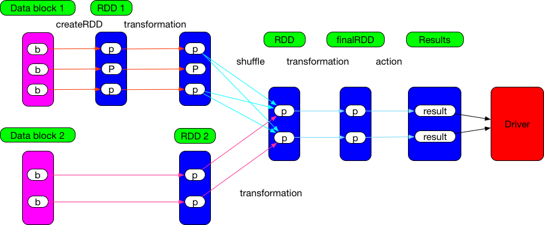

### action 与 transformation



[learn spark by an example](./learn-spark-by-an-example.md)中提到了 [transformation](http://spark.apache.org/docs/2.4.3/rdd-programming-guide.html#transformations) 和 [action](http://spark.apache.org/docs/2.4.3/rdd-programming-guide.html#actions) 两种操作，意为准换、行动。`org.apache.spark.rdd.RDD` 包含这两种算子。可以通过函数返回值来区分这两种算子：
- `transformation`：返回RDD，如map，flatMap，union等
- `action`：返回具体的值，如count，collect等

很多资料显示，transformation延迟执行，action立即执行。这是为什么呢？

以map为例：
```scala
//org.apache.spark.rdd.RDD
def map[U: ClassTag](f: T => U): RDD[U] = withScope {
    val cleanF = sc.clean(f)
    new MapPartitionsRDD[U, T](this, (context, pid, iter) => iter.map(cleanF))
}

/**
 * An RDD that applies the provided function to every partition of the parent RDD.
 */
private[spark] class MapPartitionsRDD[U: ClassTag, T: ClassTag](
    var prev: RDD[T],
    f: (TaskContext, Int, Iterator[T]) => Iterator[U],  // (TaskContext, partition index, iterator)
    preservesPartitioning: Boolean = false)
  extends RDD[U](prev) {

  override val partitioner = if (preservesPartitioning) firstParent[T].partitioner else None

  override def getPartitions: Array[Partition] = firstParent[T].partitions

  override def compute(split: Partition, context: TaskContext): Iterator[U] =
    f(context, split.index, firstParent[T].iterator(split, context))

  override def clearDependencies() {
    super.clearDependencies()
    prev = null
  }
}
```
可见，map算子只是new了一个新 `MapPartitionsRDD` 返回，并没有实际运算.

以下算子也是一样
```scala
  /**
   *  Return a new RDD by first applying a function to all elements of this
   *  RDD, and then flattening the results.
   */
  def flatMap[U: ClassTag](f: T => TraversableOnce[U]): RDD[U] = withScope {
    val cleanF = sc.clean(f)
    new MapPartitionsRDD[U, T](this, (context, pid, iter) => iter.flatMap(cleanF))
  }

  /**
   * Return a new RDD containing only the elements that satisfy a predicate.
   */
  def filter(f: T => Boolean): RDD[T] = withScope {
    val cleanF = sc.clean(f)
    new MapPartitionsRDD[T, T](
      this,
      (context, pid, iter) => iter.filter(cleanF),
      preservesPartitioning = true)
  }

  /**
   * Return a new RDD containing the distinct elements in this RDD.
   */
  def distinct(numPartitions: Int)(implicit ord: Ordering[T] = null): RDD[T] = withScope {
    map(x => (x, null)).reduceByKey((x, y) => x, numPartitions).map(_._1)
  }

  /**
   * Return a new RDD containing the distinct elements in this RDD.
   */
  def distinct(): RDD[T] = withScope {
    distinct(partitions.length)
  }
```

再来看看action
```scala
 /**
   * Return the number of elements in the RDD.
   */
  def count(): Long = sc.runJob(this, Utils.getIteratorSize _).sum

 /**
   * Applies a function f to all elements of this RDD.
   */
  def foreach(f: T => Unit): Unit = withScope {
    val cleanF = sc.clean(f)
    sc.runJob(this, (iter: Iterator[T]) => iter.foreach(cleanF))
  }

  /**
   * Applies a function f to each partition of this RDD.
   */
  def foreachPartition(f: Iterator[T] => Unit): Unit = withScope {
    val cleanF = sc.clean(f)
    sc.runJob(this, (iter: Iterator[T]) => cleanF(iter))
  }

  /**
   * Return an array that contains all of the elements in this RDD.
   *
   * @note This method should only be used if the resulting array is expected to be small, as
   * all the data is loaded into the driver's memory.
   */
  def collect(): Array[T] = withScope {
    val results = sc.runJob(this, (iter: Iterator[T]) => iter.toArray)
    Array.concat(results: _*)
  }
```

可以看到，action本质上都在调用`SparkContext`的`runJob`方法,在RDD的所有partition上运行一个job，返回一个数组，每个元素包含一个partition的结果
```scala
  /**
   * Run a job on all partitions in an RDD and return the results in an array.
   *
   * @param rdd target RDD to run tasks on
   * @param func a function to run on each partition of the RDD
   * @return in-memory collection with a result of the job (each collection element will contain
   * a result from one partition)
   */
  def runJob[T, U: ClassTag](rdd: RDD[T], func: Iterator[T] => U): Array[U] = {
    runJob(rdd, func, 0 until rdd.partitions.length)
  }
```
`SparkContext`后面有空再讲

### dependency
dependency表示RDD之间的依赖关系

RDD的构造函数里有dependency.可通过构造函数，判断是什么依赖

```scala
abstract class RDD[T: ClassTag](
    @transient private var _sc: SparkContext,
    @transient private var deps: Seq[Dependency[_]]
  )
```

有时，构造函数里的dependency是 `Nil` ,这时可以通过 `getDependencies` 方法获得依赖类型

```scala
@DeveloperApi
class UnionRDD[T: ClassTag](
    sc: SparkContext,
    var rdds: Seq[RDD[T]])
  extends RDD[T](sc, Nil) {  // Nil since we implement getDependencies

  ...

  override def getDependencies: Seq[Dependency[_]] = {
    val deps = new ArrayBuffer[Dependency[_]]
    var pos = 0
    for (rdd <- rdds) {
      deps += new RangeDependency(rdd, 0, pos, rdd.partitions.length)
      pos += rdd.partitions.length
    }
    deps
  }
  ...
}
```

dependency类图如下


父RDD : 子RDD | possible dependency
--- | ---
1:1 | OneToOneDependency
N:1 | N:1 NarrowDependency
N:N | N:N NarrowDependency(笛卡尔)

ShuffleDependency, 见 `ShuffledRDD`

有时，RDD会使用匿名内部类，不在上面的类图里面！如 笛卡尔积EDD `CartesianRDD`
```scala
private[spark]
class CartesianRDD[T: ClassTag, U: ClassTag](
    sc: SparkContext,
    var rdd1 : RDD[T],
    var rdd2 : RDD[U])
  extends RDD[(T, U)](sc, Nil)
  with Serializable {

  val numPartitionsInRdd2 = rdd2.partitions.length

  override def getPartitions: Array[Partition] = {
    // create the cross product split
    val array = new Array[Partition](rdd1.partitions.length * rdd2.partitions.length)
    for (s1 <- rdd1.partitions; s2 <- rdd2.partitions) {
      val idx = s1.index * numPartitionsInRdd2 + s2.index
      array(idx) = new CartesianPartition(idx, rdd1, rdd2, s1.index, s2.index)
    }
    array
  }

  override def getPreferredLocations(split: Partition): Seq[String] = {
    val currSplit = split.asInstanceOf[CartesianPartition]
    (rdd1.preferredLocations(currSplit.s1) ++ rdd2.preferredLocations(currSplit.s2)).distinct
  }

  override def compute(split: Partition, context: TaskContext): Iterator[(T, U)] = {
    val currSplit = split.asInstanceOf[CartesianPartition]
    for (x <- rdd1.iterator(currSplit.s1, context);
         y <- rdd2.iterator(currSplit.s2, context)) yield (x, y)
  }

  override def getDependencies: Seq[Dependency[_]] = List(
    new NarrowDependency(rdd1) {
      def getParents(id: Int): Seq[Int] = List(id / numPartitionsInRdd2)
    },
    new NarrowDependency(rdd2) {
      def getParents(id: Int): Seq[Int] = List(id % numPartitionsInRdd2)
    }
  )

  ...
}
```
NarrowDependency VS ShuffleDependency => FullDependency VS PartialDependency

NarrowDependency: 子rdd依赖父RDD中固定的Partition

ShuffleDependency: 子RDD对父RDD中的所有RDD都可能产生依赖.父RDD中的每个partition分成多个部分transformation到子RDD，reducebyKey等,


OneToOneDependency: 1对1，map，mapPartitions等

RangeDependency: 仅用于`UnionRDD`

PruneDependency: `PartitionPruningRDD`  prune意为修剪

例如: RDD通过range分区，DAG在key上有filter，range不覆盖key的分区不用发起任务

```scala
/**
 * :: DeveloperApi ::
 * An RDD used to prune RDD partitions/partitions so we can avoid launching tasks on
 * all partitions. An example use case: If we know the RDD is partitioned by range,
 * and the execution DAG has a filter on the key, we can avoid launching tasks
 * on partitions that don't have the range covering the key.
 */
@DeveloperApi
class PartitionPruningRDD[T: ClassTag](
    prev: RDD[T],
    partitionFilterFunc: Int => Boolean)
  extends RDD[T](prev.context, List(new PruneDependency(prev, partitionFilterFunc))) {

  override def compute(split: Partition, context: TaskContext): Iterator[T] = {
    firstParent[T].iterator(
      split.asInstanceOf[PartitionPruningRDDPartition].parentSplit, context)
  }

  override protected def getPartitions: Array[Partition] =
    dependencies.head.asInstanceOf[PruneDependency[T]].partitions
}
```


有时一个transformation算子导致的dependency并不固定，如 `PairRDDFunctions.cogroup` 

```scala
class PairRDDFunctions[K, V](self: RDD[(K, V)])
    (implicit kt: ClassTag[K], vt: ClassTag[V], ord: Ordering[K] = null)
  extends Logging with Serializable {
  /**
   * For each key k in `this` or `other1` or `other2` or `other3`,
   * return a resulting RDD that contains a tuple with the list of values
   * for that key in `this`, `other1`, `other2` and `other3`.
   */
  def cogroup[W1, W2, W3](other1: RDD[(K, W1)],
      other2: RDD[(K, W2)],
      other3: RDD[(K, W3)],
      partitioner: Partitioner)
      : RDD[(K, (Iterable[V], Iterable[W1], Iterable[W2], Iterable[W3]))] = self.withScope {
    if (partitioner.isInstanceOf[HashPartitioner] && keyClass.isArray) {
      throw new SparkException("HashPartitioner cannot partition array keys.")
    }
    val cg = new CoGroupedRDD[K](Seq(self, other1, other2, other3), partitioner)
    cg.mapValues { case Array(vs, w1s, w2s, w3s) =>
       (vs.asInstanceOf[Iterable[V]],
         w1s.asInstanceOf[Iterable[W1]],
         w2s.asInstanceOf[Iterable[W2]],
         w3s.asInstanceOf[Iterable[W3]])
    }
  }
}

class CoGroupedRDD[K: ClassTag](
    @transient var rdds: Seq[RDD[_ <: Product2[K, _]]],
    part: Partitioner)
  extends RDD[(K, Array[Iterable[_]])](rdds.head.context, Nil) {

  override def getDependencies: Seq[Dependency[_]] = {
    rdds.map { rdd: RDD[_] =>
      if (rdd.partitioner == Some(part)) {
        logDebug("Adding one-to-one dependency with " + rdd)
        new OneToOneDependency(rdd)
      } else {
        logDebug("Adding shuffle dependency with " + rdd)
        new ShuffleDependency[K, Any, CoGroupCombiner](
          rdd.asInstanceOf[RDD[_ <: Product2[K, _]]], part, serializer)
      }
    }
  }
}
```
当子RDD的`partitioner`与父RDD的`partitioner`相等时，产生`OneToOneDependency`. 否则，`ShuffleDependency`


ShuffleDependency 左边的 RDD 中的 record 要求是 [K, V] 型的，经过 ShuffleDependency 后，包含相同 key 的 records 会被 aggregate 到一起，然后在 aggregated 的 records 上执行不同的计算逻辑。实际执行时很多 transformation() 如 groupByKey()，reduceByKey() 是边 aggregate 数据边执行计算逻辑的，因此共同之处就是 aggregate 同时 compute()。Spark 使用 `combineByKeyWithClassTag` 来实现这个 aggregate + compute() 的基础操作。
```scala
def combineByKeyWithClassTag[C](
      createCombiner: V => C,
      mergeValue: (C, V) => C,
      mergeCombiners: (C, C) => C,
      partitioner: Partitioner,
      mapSideCombine: Boolean = true,
      serializer: Serializer = null)
```

### stage and task

如何划分stage，task?

从 `finalRDD` 往前，遇到 `ShuffleDependency` 就切分 Stage,遇 `NarrowDependency` 就加入该 Stage，每个 Stage 里 Task 的数量，由该 Stage 最后一个 RDD 的 partition 数量决定。如果 Stage 要产生 result，则里面的 Task 都是 ResultTask，否则都是 ShuffleMapTask。


`pipeline` 思想：数据用的时候再算，而且数据是流到要计算的位置

下图stage中，包含 map union partitionBy join


以笛卡尔积为例

一共6个 ResultTask.每个 Task 计算3个 RDD，读2个 data block。计算 CartesianRDD 的 partition，需要从2个RDD获取records，由于存在一个ResultTask里，不需要shuffle

不管是1:1,N:1,N:N，只要是NarrowDependency chain，就可以进行 pipeline


CartesianRDD 源码如下,很简单
```scala
private[spark]
class CartesianRDD[T: ClassTag, U: ClassTag](
    sc: SparkContext,
    var rdd1 : RDD[T],
    var rdd2 : RDD[U])
  extends RDD[(T, U)](sc, Nil)
  with Serializable {

  val numPartitionsInRdd2 = rdd2.partitions.length

  // m * n
  override def getPartitions: Array[Partition] = {
    // create the cross product split
    val array = new Array[Partition](rdd1.partitions.length * rdd2.partitions.length)
    for (s1 <- rdd1.partitions; s2 <- rdd2.partitions) {
      val idx = s1.index * numPartitionsInRdd2 + s2.index
      array(idx) = new CartesianPartition(idx, rdd1, rdd2, s1.index, s2.index)
    }
    array
  }

  override def getPreferredLocations(split: Partition): Seq[String] = {
    val currSplit = split.asInstanceOf[CartesianPartition]
    (rdd1.preferredLocations(currSplit.s1) ++ rdd2.preferredLocations(currSplit.s2)).distinct
  }

  override def compute(split: Partition, context: TaskContext): Iterator[(T, U)] = {
    val currSplit = split.asInstanceOf[CartesianPartition]
    for (x <- rdd1.iterator(currSplit.s1, context);
         y <- rdd2.iterator(currSplit.s2, context)) yield (x, y)
  }

  override def getDependencies: Seq[Dependency[_]] = List(
    new NarrowDependency(rdd1) {
      def getParents(id: Int): Seq[Int] = List(id / numPartitionsInRdd2)
    },
    new NarrowDependency(rdd2) {
      def getParents(id: Int): Seq[Int] = List(id % numPartitionsInRdd2)
    }
  )

  override def clearDependencies() {
    super.clearDependencies()
    rdd1 = null
    rdd2 = null
  }
}
```

再看看MapPartitionsRDD源码
```scala
/**
 * An RDD that applies the provided function to every partition of the parent RDD.
 */
private[spark] class MapPartitionsRDD[U: ClassTag, T: ClassTag](
    var prev: RDD[T],
    f: (TaskContext, Int, Iterator[T]) => Iterator[U],  // (TaskContext, partition index, iterator)
    preservesPartitioning: Boolean = false)
  extends RDD[U](prev) {

  //firstParent  父RDD中的第一个
  override val partitioner = if (preservesPartitioning) firstParent[T].partitioner else None

  override def getPartitions: Array[Partition] = firstParent[T].partitions

  override def compute(split: Partition, context: TaskContext): Iterator[U] =
    f(context, split.index, firstParent[T].iterator(split, context))

  override def clearDependencies() {
    super.clearDependencies()
    prev = null
  }
}
```

可见，compute调用父RDD的iterator方法，将父RDD或data block中的records一个个fetch过来

---
[SparkInternals JobPhysicalPlan](https://github.com/JerryLead/SparkInternals/blob/master/markdown/3-JobPhysicalPlan.md)