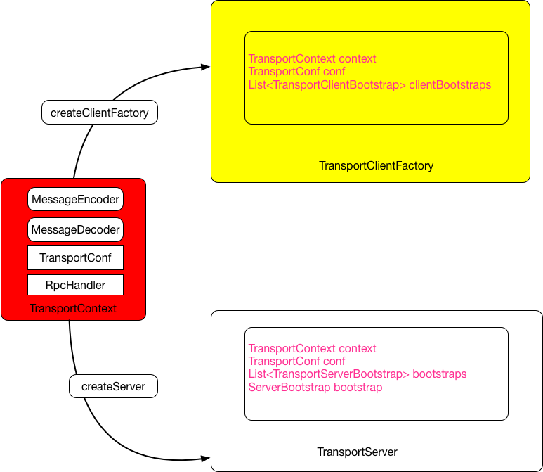

### spark配置
`SparkConf`是Spark的配置类.
```scala
private val settings = new ConcurrentHashMap[String, String]()
```
配置以[String, String]的形式保存在`ConcurrentHashMap`中。配置Spark参数有以下三种形式：

    1. 系统属性中以"spark."开头的属性
    2. 调用SparkConf的api
    3. 从其他SparkConf克隆

其中，直接通过SparkConf设置的属性优先级比系统属性优先级高

#### 系统属性中以"spark."开头的属性
```scala
class SparkConf(loadDefaults: Boolean) extends Cloneable with Logging with Serializable {

  import SparkConf._

  /** Create a SparkConf that loads defaults from system properties and the classpath */
  def this() = this(true)

  private val settings = new ConcurrentHashMap[String, String]()

  @transient private lazy val reader: ConfigReader = {
    val _reader = new ConfigReader(new SparkConfigProvider(settings))
    _reader.bindEnv(new ConfigProvider {
      override def get(key: String): Option[String] = Option(getenv(key))
    })
    _reader
  }

  if (loadDefaults) {
    loadFromSystemProperties(false)
  }

  private[spark] def loadFromSystemProperties(silent: Boolean): SparkConf = {
    // Load any spark.* system properties
    for ((key, value) <- Utils.getSystemProperties if key.startsWith("spark.")) {
      set(key, value, silent)
    }
    this
  }

  private[spark] def set(key: String, value: String, silent: Boolean): SparkConf = {
    if (key == null) {
      throw new NullPointerException("null key")
    }
    if (value == null) {
      throw new NullPointerException("null value for " + key)
    }
    if (!silent) {
      logDeprecationWarning(key)
    }
    settings.put(key, value)
    this
  }

  ...
}

/**
 * Various utility methods used by Spark.
 */
private[spark] object Utils extends Logging {

  ...

  /**
   * Returns the system properties map that is thread-safe to iterator over. It gets the
   * properties which have been set explicitly, as well as those for which only a default value
   * has been defined.
   */
  def getSystemProperties: Map[String, String] = {
    System.getProperties.stringPropertyNames().asScala
      .map(key => (key, System.getProperty(key))).toMap
  }
  
  ...
}
```
可以看到，`loadDefaults`参数决定是否使用系统参数中以 `spark.`开头的属性，并将其保存到settings中。默认是`true`

#### 直接设置SparkConf
```scala
  /** Set a configuration variable. */
  def set(key: String, value: String): SparkConf = {
    set(key, value, false)
  }

  private[spark] def set(key: String, value: String, silent: Boolean): SparkConf = {
    if (key == null) {
      throw new NullPointerException("null key")
    }
    if (value == null) {
      throw new NullPointerException("null value for " + key)
    }
    if (!silent) {
      logDeprecationWarning(key)
    }
    settings.put(key, value)
    this
  }

  /**
   * The master URL to connect to, such as "local" to run locally with one thread, "local[4]" to
   * run locally with 4 cores, or "spark://master:7077" to run on a Spark standalone cluster.
   */
  def setMaster(master: String): SparkConf = {
    set("spark.master", master)
  }

  /** Set a name for your application. Shown in the Spark web UI. */
  def setAppName(name: String): SparkConf = {
    set("spark.app.name", name)
  }

  /** Set JAR files to distribute to the cluster. */
  def setJars(jars: Seq[String]): SparkConf = {
    for (jar <- jars if (jar == null)) logWarning("null jar passed to SparkContext constructor")
    set("spark.jars", jars.filter(_ != null).mkString(","))
  }

  /** Set JAR files to distribute to the cluster. (Java-friendly version.) */
  def setJars(jars: Array[String]): SparkConf = {
    setJars(jars.toSeq)
  }
```
部分setXxx自动设置了key

#### clone
当spark多个组件共享配置，可以
1. 把SparkConf变量共享，或通过参数传递给其他组件。但并发下，ConcurrentHashMap性能下降
2. 使用clone(),优雅，避免复制代码臃肿

```scala
  /** Copy this object */
  override def clone: SparkConf = {
    val cloned = new SparkConf(false)//不使用系统配置，下面的foreach会完全复制配置
    settings.entrySet().asScala.foreach { e =>
      cloned.set(e.getKey(), e.getValue(), true)
    }
    cloned
  }
```


### spark内置RPC框架
Spark组件间的消息互通、用户文件与Jar包的上传、节点间的Shuffle过程、Block数据的复制与备份等都用到Spark RPC



#### Spark RPC各组件简介

TransportContext：Contains the context to create a TransportServer, TransportClientFactory, and to setup Netty Channel pipelines with a TransportChannelHandler.

TransportConf：A central location that tracks all the settings we expose to users。用于创建TransportClientFactory、TransportServer

RpcHandler：Handler for `sendRPC()` messages sent by `link org.apache.spark.network.client.TransportClient`s.只用于创建TransportServer

MessageEncoder：服务端用于给`server-to-client responses`编码，无状态，多线程安全

MessageDecoder：客户端将`server-to-client responses`解码，无状态，多线程安全

RpcResponseCallback：Callback for the result of a single RPC. This will be invoked once with either success or failure

TransportClientBootstrap：A bootstrap which is executed on a TransportClient before it is returned to the user.

TransportRequestHandler：A handler that processes requests from clients and writes chunk data back.

TransportResponseHandler：Handler that processes server responses

TransportChannelHandler：The single Transport-level Channel handler which is used for delegating requests to the TransportRequestHandler and responses to the TransportResponseHandler.

TransportServerBootstrap：A bootstrap which is executed on a TransportServer's client channel once a client connects to the server.

TransportClientFactory包含针对每个Socket地址的连接池
```scala
  private final ConcurrentHashMap<SocketAddress, ClientPool> connectionPool;

  /** A simple data structure to track the pool of clients between two peer nodes. */
  private static class ClientPool {
    TransportClient[] clients;
    Object[] locks;

    //对不同的TransportClient采用不同的锁，类似于锁分段，降低并发下的锁争用
    ClientPool(int size) {
      clients = new TransportClient[size];
      locks = new Object[size];
      for (int i = 0; i < size; i++) {
        locks[i] = new Object();
      }
    }
  }
```
#### Spark RPC各组件详解

- 
- 

RPC服务器TransportServer
管道初始化
RPC传输管道处理器TransportChannelHandler详解
服务端RpcHandler详解
服务端引导程序TransportServerBootstrap
客户端TransportClient详解
