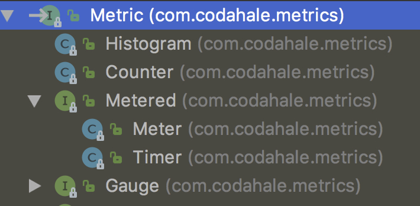
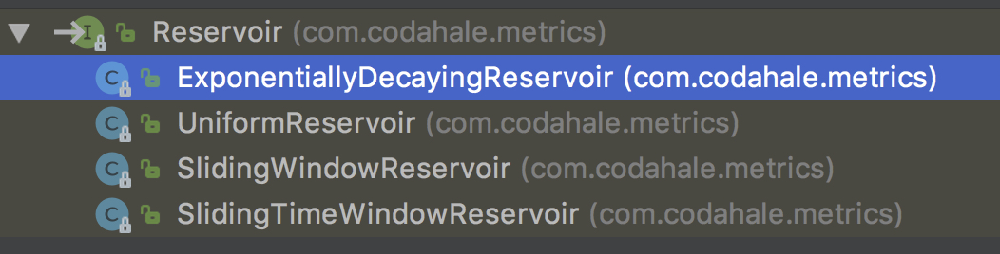
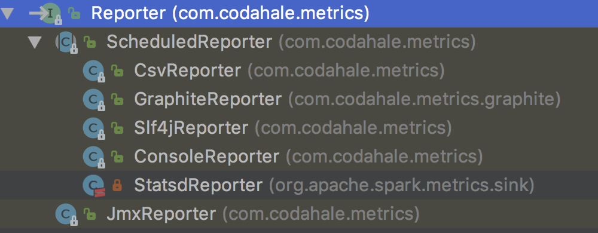

### 简介
[metrics](https://metrics.dropwizard.io)让你以非并行的视角看到你的代码做了什么，给你强大的工具箱衡量生产环境中关键组件的行为。

使用通用库，例如`Jetty, Logback, Log4j, Apache HttpClient, Ehcache, JDBI, Jersey `，报告给`Graphite`，metrics给你全栈的可视化。

### Metrics Core
- mertic 注册
- 5 metric types: Gauges, Counters, Histograms, Meters, and Timers.
- 报告度量值，via JMX,console,log,csv

#### Metric Registries
度量注册的主类是`MetricRegistry`,所有metric实例的注册服务。通常，一个应用一个MetricRegistry，(spark每个`source`一个registry，如DAGSchedulerSource)

```java
public class MetricRegistry implements MetricSet {
    // 以.相连
    public static String name(String name, String... names) {
        final StringBuilder builder = new StringBuilder();
        append(builder, name);
        if (names != null) {
            for (String s : names) {
                append(builder, s);
            }
        }
        return builder.toString();
    }

    public static String name(Class<?> klass, String... names) {
        return name(klass.getName(), names);
    }

    private static void append(StringBuilder builder, String part) {
        if (part != null && !part.isEmpty()) {
            if (builder.length() > 0) {
                builder.append('.');
            }
            builder.append(part);
        }
    }

    private final ConcurrentMap<String, Metric> metrics;
    private final List<MetricRegistryListener> listeners;

    public MetricRegistry() {
        this.metrics = buildMap();
        this.listeners = new CopyOnWriteArrayList<MetricRegistryListener>();
    }

    /**
     * Given a {@link Metric}, registers it under the given name.
     * 以<name, metric>的形式，插入metrics
     * @param name   the name of the metric
     * @param metric the metric
     * @param <T>    the type of the metric
     * @return {@code metric}
     * @throws IllegalArgumentException if the name is already registered
     */
    @SuppressWarnings("unchecked")
    public <T extends Metric> T register(String name, T metric) throws IllegalArgumentException {
        if (metric instanceof MetricSet) {
            registerAll(name, (MetricSet) metric);
        } else {
            final Metric existing = metrics.putIfAbsent(name, metric);
            if (existing == null) {
                onMetricAdded(name, metric);
            } else {
                throw new IllegalArgumentException("A metric named " + name + " already exists");
            }
        }
        return metric;
    }

   /**
     * Given a metric set, registers them.
     *
     * @param metrics    a set of metrics
     * @throws IllegalArgumentException if any of the names are already registered
     */
    public void registerAll(MetricSet metrics) throws IllegalArgumentException {
        registerAll(null, metrics);
    }

    private void registerAll(String prefix, MetricSet metrics) throws IllegalArgumentException {
        for (Map.Entry<String, Metric> entry : metrics.getMetrics().entrySet()) {
            if (entry.getValue() instanceof MetricSet) {
                registerAll(name(prefix, entry.getKey()), (MetricSet) entry.getValue());
            } else {
                register(name(prefix, entry.getKey()), entry.getValue());
            }
        }
    }

    @Override
    public Map<String, Metric> getMetrics() {
        return Collections.unmodifiableMap(metrics);
    }

   /**
     * Return the {@link Counter} registered under this name; or create and register 
     * a new {@link Counter} if none is registered.
     *
     * @param name the name of the metric
     * @return a new or pre-existing {@link Counter}
     */
    public Counter counter(String name) {
        return getOrAdd(name, MetricBuilder.COUNTERS);
    }

    // histogram(String name) meter(String name) timer(String name)

    private <T extends Metric> T getOrAdd(String name, MetricBuilder<T> builder) {
        final Metric metric = metrics.get(name);
        if (builder.isInstance(metric)) {
            return (T) metric;
        } else if (metric == null) {
            try {
                return register(name, builder.newMetric());
            } catch (IllegalArgumentException e) {
                final Metric added = metrics.get(name);
                if (builder.isInstance(added)) {
                    return (T) added;
                }
            }
        }
        throw new IllegalArgumentException(name + " is already used for a different type of metric");
    }


    /**
     * A quick and easy way of capturing the notion of default metrics.
     */
    private interface MetricBuilder<T extends Metric> {
        MetricBuilder<Counter> COUNTERS = new MetricBuilder<Counter>() {
            @Override
            public Counter newMetric() {
                return new Counter();
            }

            @Override
            public boolean isInstance(Metric metric) {
                return Counter.class.isInstance(metric);
            }
        };

        // METERS Timer

        MetricBuilder<Histogram> HISTOGRAMS = new MetricBuilder<Histogram>() {
            @Override
            public Histogram newMetric() {
                return new Histogram(new ExponentiallyDecayingReservoir());
            }

            @Override
            public boolean isInstance(Metric metric) {
                return Histogram.class.isInstance(metric);
            }
        };

        T newMetric();

        boolean isInstance(Metric metric);
    }
}
```
省略了监听器相关代码，因为比较简单，且不是重点。

#### 5 metric types


##### Gauge
即时读取特定的值(an instantaneous reading of a particular value)
```java
public interface Gauge<T> extends Metric {
    /**
     * Returns the metric's current value.
     *
     * @return the metric's current value
     */
    T getValue();
}
```
example:
```java
   final Queue<String> queue = new ConcurrentLinkedQueue<String>();
   final Gauge<Integer> queueDepth = new Gauge<Integer>() {
       public Integer getValue() {
           return queue.size();
       }
   };
```

Gauge有几个实现类:`RatioGauge`,`JmxAttributeGauge`,`DerivativeGauge`
以CachedGauge为例,可用于耗时的操作
```java
public abstract class CachedGauge<T> implements Gauge<T> {
    private final Clock clock;
    private final AtomicLong reloadAt;
    private final long timeoutNS;

    private volatile T value;// 缓存

    /**
     * Creates a new cached gauge with the given timeout period.
     *
     * @param timeout        the timeout
     * @param timeoutUnit    the unit of {@code timeout}
     */
    protected CachedGauge(long timeout, TimeUnit timeoutUnit) {
        this(Clock.defaultClock(), timeout, timeoutUnit);
    }

    /**
     * Creates a new cached gauge with the given clock and timeout period.
     *
     * @param clock          the clock used to calculate the timeout
     * @param timeout        the timeout
     * @param timeoutUnit    the unit of {@code timeout}
     */
    protected CachedGauge(Clock clock, long timeout, TimeUnit timeoutUnit) {
        this.clock = clock;
        this.reloadAt = new AtomicLong(0);
        this.timeoutNS = timeoutUnit.toNanos(timeout);
    }

    /**
     * Loads the value and returns it.
     * 更新缓存
     * @return the new value
     */
    protected abstract T loadValue();

    @Override
    public T getValue() {
        if (shouldLoad()) {
            this.value = loadValue();
        }
        return value;
    }

    private boolean shouldLoad() {
        for (; ; ) {
            final long time = clock.getTick();
            final long current = reloadAt.get();
            if (current > time) {
                return false;
            }
            if (reloadAt.compareAndSet(current, time + timeoutNS)) {
                return true;
            }
        }
    }
}
```

##### <a href="#" name="counter">Counter</a>
```java
/**
 * An incrementing and decrementing counter metric.
 */
public class Counter implements Metric, Counting {
    private final LongAdderAdapter count;

    public Counter() {
        this.count = LongAdderProxy.create();
    }

    /**
     * Increment the counter by one.
     */
    public void inc() {
        inc(1);
    }

    /**
     * Increment the counter by {@code n}.
     *
     * @param n the amount by which the counter will be increased
     */
    public void inc(long n) {
        count.add(n);
    }

    /**
     * Decrement the counter by one.
     */
    public void dec() {
        dec(1);
    }

    /**
     * Decrement the counter by {@code n}.
     *
     * @param n the amount by which the counter will be decreased
     */
    public void dec(long n) {
        count.add(-n);
    }

    /**
     * Returns the counter's current value.
     *
     * @return the counter's current value
     */
    @Override
    public long getCount() {
        return count.sum();
    }
}
```

##### Histogram
直方图,度量数据流的分布
```java
/**
 * A metric which calculates the distribution of a value.
 *
 * @see <a href="http://www.johndcook.com/standard_deviation.html">Accurately computing running
 *      variance</a>
 */
public class Histogram implements Metric, Sampling, Counting {
    private final Reservoir reservoir;
    private final LongAdderAdapter count;

    /**
     * Creates a new {@link Histogram} with the given reservoir.
     *
     * @param reservoir the reservoir to create a histogram from
     */
    public Histogram(Reservoir reservoir) {
        this.reservoir = reservoir;
        this.count = LongAdderProxy.create();
    }

    /**
     * Adds a recorded value.
     *
     * @param value the length of the value
     */
    public void update(int value) {
        update((long) value);
    }

    /**
     * Adds a recorded value.
     *
     * @param value the length of the value
     */
    public void update(long value) {
        count.increment();
        reservoir.update(value);
    }

    /**
     * Returns the number of values recorded.
     *
     * @return the number of values recorded
     */
    @Override
    public long getCount() {
        return count.sum();
    }

    @Override
    public Snapshot getSnapshot() {
        return reservoir.getSnapshot();
    }
}

public abstract class Snapshot {
    public double getMedian()
    public double get75thPercentile()
    ...
}
```
同时具备<a href="#counter">Counter</a>#getCount()功能 和 <a href="#reservoir">Reservoir</a>#getSnapshot()方法

直方图可以测量min,max,mean,standard deviation，以及分位数，如中位数、p95等等

通常，取分位数需要获取全量数据集，排序，取值。这适合用于小数据集、批处理系统，不适用于高吞吐、低延迟服务。

解决方法，是在数据经过时取样。通过维护一个小的、可管理的、在统计上代表整个数据流的储层，我们可以快速而容易地计算出分位数，这是实际分位数的有效近似值。这种技术被称为`储层取样(reservoir sampling)`。

目前共有以下几种储层



##### Meter
测量平均吞吐量，1min、5min、15min的指数权重吞吐量(rate * duration)
```shell
Just like the Unix load averages visible in uptime or top.
```

##### Timers
```java
/**
 * A timer metric which aggregates timing durations and provides duration statistics, plus
 * throughput statistics via {@link Meter}.
 */
public class Timer implements Metered, Sampling {

    private final Meter meter;
    private final Histogram histogram;
    private final Clock clock;
}
```
聚合时长、时长统计(histogram)、以及吞吐量(meter)

#### reporters
导出metrics统计出的结果，`metrics-core`提供了四种方式：JMX, console, SLF4J, and CSV.



##### ScheduledReporter
```java
/**
 * The abstract base class for all scheduled reporters (i.e., reporters which process a registry's
 * metrics periodically).
 * 
 * 调度reporters的基类，周期处理registry的metrics
 * @see ConsoleReporter
 * @see CsvReporter
 * @see Slf4jReporter
 */
public abstract class ScheduledReporter implements Closeable, Reporter {

    private static final Logger LOG = LoggerFactory.getLogger(ScheduledReporter.class);

    /**
     * A simple named thread factory.
     */
    @SuppressWarnings("NullableProblems")
    private static class NamedThreadFactory implements ThreadFactory {
        private final ThreadGroup group;
        private final AtomicInteger threadNumber = new AtomicInteger(1);
        private final String namePrefix;

        private NamedThreadFactory(String name) {
            final SecurityManager s = System.getSecurityManager();
            this.group = (s != null) ? s.getThreadGroup() : Thread.currentThread().getThreadGroup();
            this.namePrefix = "metrics-" + name + "-thread-";
        }

        @Override
        public Thread newThread(Runnable r) {
            final Thread t = new Thread(group, r, namePrefix + threadNumber.getAndIncrement(), 0);
            t.setDaemon(true);
            if (t.getPriority() != Thread.NORM_PRIORITY) {
                t.setPriority(Thread.NORM_PRIORITY);
            }
            return t;
        }
    }

    private static final AtomicInteger FACTORY_ID = new AtomicInteger();

    private final MetricRegistry registry;
    private final ScheduledExecutorService executor;
    private final MetricFilter filter;
    private final double durationFactor;
    private final String durationUnit;
    private final double rateFactor;
    private final String rateUnit;

    /**
     * Creates a new {@link ScheduledReporter} instance.
     *
     * @param registry the {@link com.codahale.metrics.MetricRegistry} containing the metrics this
     *                 reporter will report
     * @param name     the reporter's name
     * @param filter   the filter for which metrics to report
     * @param rateUnit a unit of time
     * @param durationUnit a unit of time
     */
    protected ScheduledReporter(MetricRegistry registry,
                                String name,
                                MetricFilter filter,
                                TimeUnit rateUnit,
                                TimeUnit durationUnit) {
		this(registry, name, filter, rateUnit, durationUnit,
                Executors.newSingleThreadScheduledExecutor(new NamedThreadFactory(name + '-' + FACTORY_ID.incrementAndGet())));
    }

    /**
     * Creates a new {@link ScheduledReporter} instance.
     *
     * @param registry the {@link com.codahale.metrics.MetricRegistry} containing the metrics this
     *                 reporter will report
     * @param name     the reporter's name
     * @param filter   the filter for which metrics to report
     * @param executor the executor to use while scheduling reporting of metrics.
     */
    protected ScheduledReporter(MetricRegistry registry,
                                String name,
                                MetricFilter filter,
                                TimeUnit rateUnit,
                                TimeUnit durationUnit,
                                ScheduledExecutorService executor) {
        this.registry = registry;
        this.filter = filter;
        this.executor = executor;
        this.rateFactor = rateUnit.toSeconds(1);
        this.rateUnit = calculateRateUnit(rateUnit);
        this.durationFactor = 1.0 / durationUnit.toNanos(1);
        this.durationUnit = durationUnit.toString().toLowerCase(Locale.US);
    }

    /**
     * Starts the reporter polling at the given period.
     * 开始定时任务
     * @param period the amount of time between polls
     * @param unit   the unit for {@code period}
     */
    public void start(long period, TimeUnit unit) {
        executor.scheduleAtFixedRate(new Runnable() {
            @Override
            public void run() {
                try {
                    report();
                } catch (Exception ex) {
                    LOG.error("Exception thrown from {}#report. Exception was suppressed.", ScheduledReporter.this.getClass().getSimpleName(), ex);
                }
            }
        }, period, period, unit);
    }

    /**
     * Stops the reporter and shuts down its thread of execution.
     *
     * Uses the shutdown pattern from http://docs.oracle.com/javase/7/docs/api/java/util/concurrent/ExecutorService.html
     */
    public void stop() {
        executor.shutdown(); // Disable new tasks from being submitted
        try {
            // Wait a while for existing tasks to terminate
            if (!executor.awaitTermination(1, TimeUnit.SECONDS)) {
                executor.shutdownNow(); // Cancel currently executing tasks
                // Wait a while for tasks to respond to being cancelled
                if (!executor.awaitTermination(1, TimeUnit.SECONDS)) {
                    System.err.println(getClass().getSimpleName() + ": ScheduledExecutorService did not terminate");
                }
            }
        } catch (InterruptedException ie) {
            // (Re-)Cancel if current thread also interrupted
            executor.shutdownNow();
            // Preserve interrupt status
            Thread.currentThread().interrupt();
        }
    }

    /**
     * Stops the reporter and shuts down its thread of execution.
     */
    @Override
    public void close() {
        stop();
    }

    /**
     * Report the current values of all metrics in the registry.
     * 输出metrics，synchronized
     */
    public void report() {
        synchronized (this) {
            report(registry.getGauges(filter),
                    registry.getCounters(filter),
                    registry.getHistograms(filter),
                    registry.getMeters(filter),
                    registry.getTimers(filter));
        }
    }

    /**
     * Called periodically by the polling thread. Subclasses should report all the given metrics.
     * 留给子类继承
     * @param gauges     all of the gauges in the registry
     * @param counters   all of the counters in the registry
     * @param histograms all of the histograms in the registry
     * @param meters     all of the meters in the registry
     * @param timers     all of the timers in the registry
     */
    public abstract void report(SortedMap<String, Gauge> gauges,
                                SortedMap<String, Counter> counters,
                                SortedMap<String, Histogram> histograms,
                                SortedMap<String, Meter> meters,
                                SortedMap<String, Timer> timers);
}
```

##### Other Reporters
[MetricsServlet](https://metrics.dropwizard.io/4.0.0/manual/servlets.html#manual-servlets) 健康检查、thread dump、JVM-level and OS-level信息

[GraphiteReporter](https://metrics.dropwizard.io/4.0.0/manual/graphite.html#manual-graphite)图形界面

#### JVM Instrumentation
[metrics-jvm](https://metrics.dropwizard.io/4.0.0/manual/jvm.html)

    - Run count and elapsed times for all supported garbage collectors
    - Memory usage for all memory pools, including off-heap memory
    - Breakdown of thread states, including deadlocks
    - File descriptor usage
    - Buffer pool sizes and utilization

[Monitoring your JVM with Dropwizard Metrics](https://www.stubbornjava.com/posts/monitoring-your-jvm-with-dropwizard-metrics)

---

### 参考

[metrics操作手册](https://metrics.dropwizard.io/4.0.0/manual/core.html)